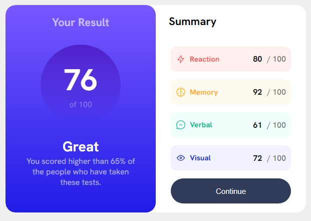
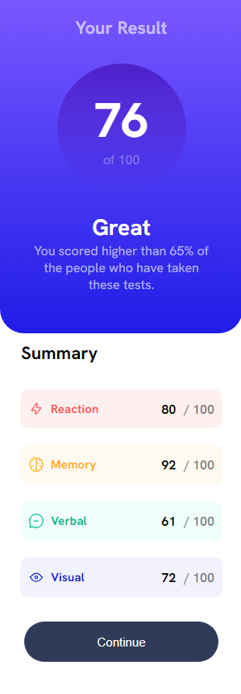

### Screenshot


- Solution URL: [Add solution URL here](https://your-solution-url.com)
- Live Site URL: [file:///C:/Users/hp%20prro/Desktop/stg/entrainnement.html](https://your-live-site-url.com)
```html
<html lang="en">
<head>
    <link href="entrain1.css" rel="stylesheet">
    <meta charset="UTF-8">
    <meta name="viewport" content="width=device-width, initial-scale=1.0">
    <title>Document</title>
    <link rel="preconnect" href="https://fonts.googleapis.com">
<link rel="preconnect" href="https://fonts.gstatic.com" crossorigin>
<link href="https://fonts.googleapis.com/css2?family=Hanken+Grotesk:ital,wght@0,400;0,500;0,700;0,800;1,700;1,900&display=swap" rel="stylesheet">
</head>
<body>
    
<div class="main-container">
    <div class="score-container">
        <h2 class="score-container__title">Your Result</h2>
       
        <div class="score-container__score">
            
                <div>
                    <span><strong class="score-container__number1">76</strong></span>
                    <span class="score-container__number2">of 100</span>
                </div>
            
        </div>
        <div class="score-container__notes">
                <h1 class="score-container__appreciation">Great</h1>
               <pre></pre> <p class="score-container__average">You scored higher than 65% of the people who have taken these tests.</p>
        </div>
       
    </div>
    <div class="summary-container">
        <h3 class="summary-container__title">Summary</h3>
       <div class="summary-container__row gesture">
            <div class="summary-container__gesture">
                <svg xmlns="http://www.w3.org/2000/svg" width="20" height="20" fill="none" viewBox="0 0 20 20"><path stroke="#F55" stroke-linecap="round" stroke-linejoin="round" stroke-width="1.25" d="M10.833 8.333V2.5l-6.666 9.167h5V17.5l6.666-9.167h-5Z"/></svg>
                <p class="summary-container__case">Reaction</p>
            </div>
            <span>80 <strong class="summary-container__counter">/ 100</strong></span>
       </div>
        <div class="summary-container__row brain">
            <div class="summary-container__brain">
                <svg xmlns="http://www.w3.org/2000/svg" width="20" height="20" fill="none" viewBox="0 0 20 20"><path stroke="#FFB21E" stroke-linecap="round" stroke-linejoin="round" stroke-width="1.25" d="M5.833 11.667a2.5 2.5 0 1 0 .834 4.858"/><path stroke="#FFB21E" stroke-linecap="round" stroke-linejoin="round" stroke-width="1.25" d="M3.553 13.004a3.333 3.333 0 0 1-.728-5.53m.025-.067a2.083 2.083 0 0 1 2.983-2.824m.199.054A2.083 2.083 0 1 1 10 3.75v12.917a1.667 1.667 0 0 1-3.333 0M10 5.833a2.5 2.5 0 0 0 2.5 2.5m1.667 3.334a2.5 2.5 0 1 1-.834 4.858"/><path stroke="#FFB21E" stroke-linecap="round" stroke-linejoin="round" stroke-width="1.25" d="M16.447 13.004a3.334 3.334 0 0 0 .728-5.53m-.025-.067a2.083 2.083 0 0 0-2.983-2.824M10 3.75a2.085 2.085 0 0 1 2.538-2.033 2.084 2.084 0 0 1 1.43 2.92m-.635 12.03a1.667 1.667 0 0 1-3.333 0"/></svg>
                <p class="summary-container__case">Memory</p>
            </div>
            <span>92 <strong class="summary-container__counter">/ 100</strong></span>
        </div>
        <div class="summary-container__row voice">
            <div class="summary-container__voice">
                <svg xmlns="http://www.w3.org/2000/svg" width="20" height="20" fill="none" viewBox="0 0 20 20"><path stroke="#00BB8F" stroke-linecap="round" stroke-linejoin="round" stroke-width="1.25" d="M7.5 10h5M10 18.333A8.333 8.333 0 1 0 1.667 10c0 1.518.406 2.942 1.115 4.167l-.699 3.75 3.75-.699A8.295 8.295 0 0 0 10 18.333Z"/></svg>
                <p class="summary-container__case">Verbal</p>
            </div>
            <span >61 <strong class="summary-container__counter">/ 100</strong></span>
        </div>
        <div class="summary-container__row views">
            <div class="summary-container__views">
                <svg xmlns="http://www.w3.org/2000/svg" width="20" height="20" fill="none" viewBox="0 0 20 20"><path stroke="#1125D6" stroke-linecap="round" stroke-linejoin="round" stroke-width="1.25" d="M10 11.667a1.667 1.667 0 1 0 0-3.334 1.667 1.667 0 0 0 0 3.334Z"/><path stroke="#1125D6" stroke-linecap="round" stroke-linejoin="round" stroke-width="1.25" d="M17.5 10c-1.574 2.492-4.402 5-7.5 5s-5.926-2.508-7.5-5C4.416 7.632 6.66 5 10 5s5.584 2.632 7.5 5Z"/></svg>
                <p class="summary-container__case">Visual</p>
            </div>
            <span >72 <strong class="summary-container__counter">/ 100</strong></span>
        </div>
        <button type="submit">Continue</button>
    </div>
</div>

</body>
</html>
```
```css
*{
    margin: 0;
    padding: 0;
}
body{
    background:rgb(106, 100, 93,.1);
    font-family: 'Hanken Grotesk', sans-serif;
    font-size: 16px;
    margin: 0!important;
}
.main-container{
    max-width: 600px;
    display: grid;
    grid-template-columns: 50% 50%;
    width: 100%;
    margin-right: auto;
    margin-left: auto;
    margin-top: 50px;
    margin-bottom: 50px;
    overflow: hidden;
    border-radius: 20px;
    background: rgba(255, 255, 255, 1);
    max-height: fit-content;
}
.score-container{
   background: linear-gradient(0deg, #201DE7, #7857FF);
   border-radius: 20px;
   color: white; 
   text-align: center;
   padding: 20px 30px;
}
.score-container__title{  
    display: block;
    margin-bottom: 30px;
    font-size: 22px;
}
.score-container__score{
    margin-left: auto;
    margin-right: auto;
    border-radius:100px;
    width:160px;
    height:160px;
    background: linear-gradient(0deg, hsla(241, 72%, 46%, 0), hsla(256, 72%, 46%, 1));
    display: flex;
    align-items: center;
    align-content: center;
    justify-content: space-around;
}
.score-container__notes{
    margin-top: 25px;
    margin-bottom: 30px;
}
.score-container__number2{
    opacity: 0.3;
    display: block;
}
.score-container__number1{
    font-size: 60px;
    display: block;
}
.score-container__appreciation{
    font-size: 25px;
    margin: 0 0 1px 0;
    display: block;
    font-size: 28px;
}
.score-container__average, .score-container__title{
    opacity: 0.6;
}
.score-container__average{
    padding: 0 10px;
    margin: 0!important; 
}
.summary-container{
    justify-content:space-around;
    padding: 10px 15px;
    border-radius: 20px;
    display: flex;
    flex-direction: column;
}
.summary-container__title{
    font-size: 22px;
    padding-left: 11px;
    margin-bottom: 20px;
}
.gesture{
    background: hsl(0, 100%, 97%);  
    padding: 10px;
}
.brain{
    background: hsl(39, 100%, 97%);
    padding: 10px;
}
.voice{
    background: hsl(166, 100%, 97%);
    padding: 10px;
}
.views{
    background: hsl(234, 85%, 97%);
    padding: 10px;
}
.summary-container__gesture{
    color: hsl(0, 100%, 67%);
    font-size: 15px;  
}
.summary-container__brain{
    color: hsl(39, 100%, 56%);
    font-size: 15px;
}
.summary-container__voice{
    color: hsl(166, 100%, 37%);
    font-size: 15px;  
}
.summary-container__views{
   color: hsl(234, 85%, 45%);
   font-size: 15px;  
}
.summary-container__row{
   border-radius: 10px;
   display: flex;
   justify-content: space-between;
   height: 30px;
   margin: 0 15px;
   min-width: 200px;
}
.summary-container__row>*{
    display: flex;
    font-weight: bold;
    align-items: center;
    justify-content: space-between;
}
.summary-container__case{
    padding-left: 8px;
}
.summary-container__counter{
    opacity: 0.5;
    margin-left:10px;
}
button{
    color: hsl(0, 0%, 100%);
    background-color:hsl(224, 30%, 27%);
    border-radius: 50px;
    height: 50px;
    width: calc(100% - 30px);
    margin-left: auto;
    margin-right: auto;
    border: 0;
    outline: 0;
    font-size: 15px;   
}
@media only screen and (max-width: 585px) {
    body{   
      width: 100%;
      padding: 0!important;
    }
    .main-container{
      width: 100%;
      flex-direction: column;
      display: block;
      border-radius: 0px;
      margin-top: 0;
      margin-bottom: 0;
    }
    .score-container{
      border-radius: 0px;
      border-bottom-left-radius: 30px;
      border-bottom-right-radius: 30px;
    }
    .summary-container{
        border-radius: 0;
    }
    .summary-container__row{
      margin: 10px; 
    }
    .score-container__average{
      padding: 0 10px;
      margin: 0!important; 
    }
    button{
      display: block;
      width: calc(100% - 30px);
      margin-top: 20px;
      margin-bottom: 30px;
    }
}
@media only screen and (max-width: 640px) {
    body{
       padding: 0 20px 10px 20px;   
       display: block;
    }
}

- Frontend Mentor - [@daryl-tores](https://www.frontendmentor.io/profile/daryl-tores)